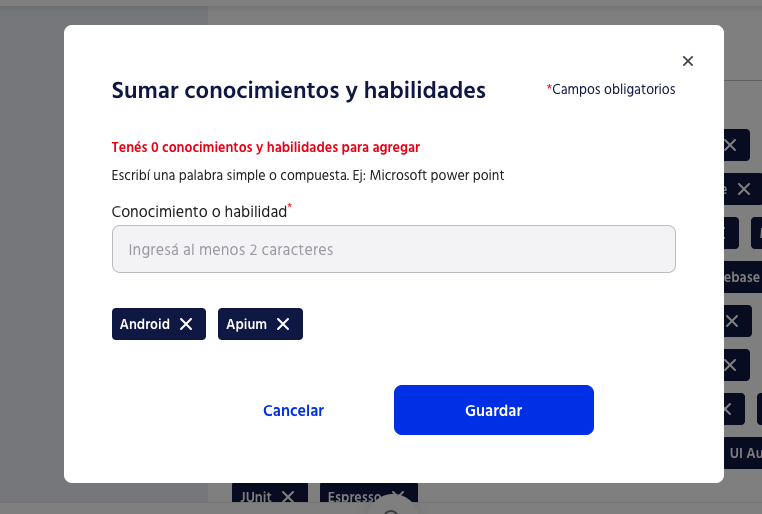

# Hack Bumeran.com

Bumeran.com no tiene soporte para agregar habilidades desde un listado o Excel, y por no querer escribir cada habilidad manualmente, me pareció más interesante hacer un script. Tal vez con Cypress hubiera sido más fácil, pero esto estaba más a la mano.

## Script ( script.js )

Puedes encontrar el script en el archivo script.js, comentare solo las partes mas importantes
```js
# Elemento de la página donde escribir el skill
const inputElement = document.querySelector('#react-select-113-input');

# Lista de skills a agregar: MAX 45, 
const skills = [
    // Lenguajes
    "Kotlin", "Java", "Swift", "Objective-C", "JavaScript",
    
    // Frameworks y Librerías
    "Android SDK", "Jetpack Compose", "Picasso", "Glide", "Lottie", 
    "Hilt", "Koin", "Gson", "JSON", "Moshi",
    
    // Plataformas y Herramientas
    "Android Studio", "Xcode", "Custom View", "XML", "Firebase",
    
    // Arquitecturas y Componentes
    "MVP", "MVVM", "SQLite", "Room", "DataBinding",
    "LifeCycle", "LiveData", "ViewModel", "Google Maps", "Restful",
    
    // Bases de Datos
    "SQLite", "Room", "Firebase Realtime", "Firestore",
    
    // Cloud
    "AWS Lambda", "S3", "EC2", "SNS", "GCP Foundation", 
    
    // Firebase
    "Firebase Auth UI", "Firebase Storage", "Firebase Analytics", "Cloud Messaging",
    
    // Testing
    "UI Automator", "JUnit", "Espresso", "Appium"
  ];

for (const skill_item of skills) {
    ...
    # Agrega cada skill
    ...  
}
```

## Pasos

### 1. Ir a tu perfil
 Ir a la pagina https://www.bumeran.com.ar/candidatos/curriculum/educacion, dependiendo de tu país

### 2. Ir a Conocimientos y habilidades


Click en "Sumar conocimientos"

### 4. Obtener el ID del input

Buscar el id del input, luego copiar el selector y reemplazarlo en el script


```js
...
const inputElement = document.querySelector('<REEMPLAZAR AQUI>');
...
```

### 3. Copiar script en console

Abrir console y pegar el script configurado con las habilidades que deseas agregar, y enter


Aparecerán agregadas




Enjoy 🎉
